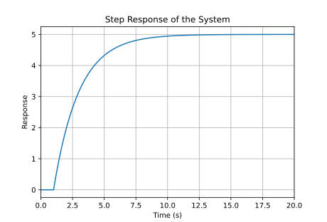
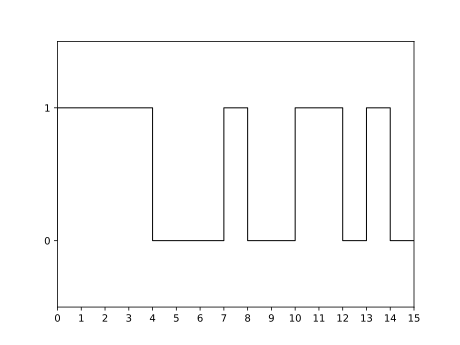

<p align='center'><font size=7><b>系统辨识基础</b></font></p>

# 系统辨识的概念

系统辨识包含以下的三个内容。

* 模型：

模型有以下几类：Intuitionistic model, Chart model, Physical model, Mathematical model etc.

**建模方法**：

Theoretical analysis method

practical test method

hybrid method

## 系统的性质

* 确定性和随机性

看有没有不确定项。比如：
$$
y(k+1)&=&ay(k)+bu(k)\\
y(k+1)&=&ay(k)+bu(k)+\xi(k)
$$
$\xi(k)$是随机噪声。这两个式子可以发现，上一行我们可以根据a和b的值来酸楚确定的输出，体现了**确定性**；而下一行的式子由于随机噪声的存在，无法算出准确的输出，更不能逐级递推往后算出更远的输出，体现了**随机性**。

* 模型和时间的关系：静态和动态

静态系统：**所有state对时间的导数为0**，例如$ y(k)=au(k)$

动态系统：**所有state对时间的导数不全为0**（导数值大小可以随时间变化），例如$ y(k+1)=ay(k)+bu(k) $，因为$\dot y = \frac{y(k+1)-y(k)}{dt}\neq0~for~a\neq0 $

* Time scale: 连续模型和离散模型

略。

* 参数和时间的关系：时变性和时不变性

$$
y(k+1)&=&ay(k)+bu(k)\\
y(k+1)&=&a(k)y(k)+b(k)u(k)
$$

当参数a，b为常数的时候，为时不变系统（第一行）；如果a，b中至少有一个是和时间有关的参数，则为时变系统（第二行）。

* 参数和输入输出的关系：线性和非线性

线性模型：同时满足叠加性和齐次性。例如：
$$
y(k+1)=ay(k-1)+bu(k)
$$
非线形模型：不满足叠加性或齐次性。例如：
$$
\dot y(t)&=&ay(t)+by(t)u(t)\\
$$

> 叠加性：$ f(a+b)=f(a)+f(b) $; 齐次性：$ f(ak)=af(k) $
>
> 对于第一个系统：假设k时刻，状态和输入$y_1(k-1),u_1(k),y_2(k-1),u_2(k)$分别得到$y_1(k+1),y_2(k+1)$
> $$
> y_1(k+1) &=& a y_1(k-1) + b u_1(k)\\
> y_2(k+1) &=& a y_2(k-1) + b u_2(k)\\
> $$
> 当$y(k-1)=y_1(k-1)+y_2(k-1),~u(k)=u_1(k)+u_2(k)$时，假设得到$y(k+1)$：
> $$
> y(k+1)&=&ay(k-1)+bu(k)\\
> &=&a y_1(k-1) + b u_1(k)+a y_2(k-1) + b u_2(k)
> $$
> 叠加性证毕；
>
> 齐次性证明：假设状态和输入为$y_1(k-1),~u_1(k)$和$\lambda y_1(k-1),~\lambda u_1(k)$
> $$
> y_1(k+1)&=&ay_1(k-1)+bu(k)\\
> y(k+1)&=&\lambda ay_1(k-1)+\lambda bu_1(k)\\
> &=&\lambda y_1(k+1)
> $$
> 齐次性证毕。
>
> 对于第二个系统，假设状态和输入分别为$y_1(t),u_1(t)$ $和 y_2(t),u_2(t) $叠加性：
> $$
> \dot y_1(t)&=&ay_1(t)+by_1(t)u_1(t)\\
> \dot y_2(t)&=&ay_2(t)+by_2(t)u_2(t)\\
> \dot y(t)&=&a\left[y_1(t)+y_2(t)\right]+b\left[y_1(t)+y_2(t)\right]\left[u_1(t)+u_2(t)\right]\\
> &=&y_1(t)+y_2(t)+by_1(t)u_2(t)+by_2(t)u_1(t)\\
> &\neq&y_1(t)+y_2(t)
> $$
> 不满足叠加性，它不是一个线性系统。
>
> 同样，让我们来看看齐次性：
> $$
> y_1(t)&=&ay_1(t)+by_1(t)u_1(t)\\
> y(t)&=&a\lambda y_1(t)+b\lambda y_1(t)\lambda u_1(t)\\
> &\neq&\lambda y_1(t)
> $$
> 不满足齐次性，因此也不是一个线性系统。

* 模型的表达式：参数模型（parametric）和非参数模型（non-parametric）

**非参数模型**：通过实验过程中实际系统的响应（直接或间接地）建立的，比如：

阶跃响应

脉冲响应

频率响应

例如：
$$
y(k)=(\sum_{i=0}^{\infty}g(i)q^{-1})u(k)
$$
其中，$g(i)$是单位脉冲序列。

**参数模型**：通过逻辑推导方法建立的模型称。它有固定的数学形式，参数数量通常较少。例如：
$$
y(k+1)=ay(k)+bu(k)
$$

* 参数性质：集中参数系统（centralized parameters）和分布参数系统（distributed parameters）

集中参数系统：系统的状态参数仅仅是时间的函数。例如$\dot y(t)=ay(t)+bu(t)$

分部参数系统：系统状态参数不只是时间的函数。例如$ \dot y(t)=\frac{\partial y(t)}{\partial u(t)}y(t)+bu(t)$

* 输入和输出的数量。

单输入单输出SISO，多输入单输出MISO，单输入多输出SIMO，多输入多输出MIMO。


## 系统辨识的分类

* 实验方法分类：白盒，灰盒，黑盒

对于系统的结构，组成，控制律等，

白盒：全部清楚

黑盒：全部不清楚

灰盒：部分清楚

* 辨识方式：在线辨识、离线辨识

* 系统辨识手段：开环辨识盒闭环辨识


## 一种系统辨识方法——两点辨识法

对于某个**一阶系统**，可以使用**阶跃函数**采用**两点辨识法**对齐进行系统辨识。

某一阶系统的传递函数为$G(s)=\frac{K}{Ts+1}e^{-\tau s}$。它包含了三个需要被辨识的参数：增益K，时间常数T和延迟$\tau$。

我们学过，频域到时域可以使用反拉普拉斯变换。我们使用单位阶跃函数来对其进行系统辨识：
$$
Y(s)=G(s)U(s)=G(s)\cdot\frac{1}{s}
$$
转到时域：
$$
y(t)&=&L^{-1}\left[\frac{Ke^{-\tau s}}{Ts+1}\cdot\frac1s\right]\\
&=&L^{-1}\left[(\frac{1}{s}-\frac{T}{Ts+1})Ke^{-\tau s}\right]\\
&=&K(1-e^{\frac{\tau-t}{T}})
$$

* 得到K：显然，当时间趋于无穷的时候，
  $$
  \lim_{t\rightarrow\infty}y(t)=K
  $$
  因此，K的大小为无穷时间处的输出值；

* 得到T和$ \tau $：选取两个时刻$t_1,t_2$，获得这两个时刻的输出，建立方程：

$$
y(t_1)=K(1-e^{\frac{\tau-t_1}{T}})\\
y(t_2)=K(1-e^{\frac{\tau-t_2}{T}})
$$

解开即可。

> 解方程：
> $$
> \frac{y(t_1)}{K}&=&1-e^{\frac{\tau-t_1}{T}}\\
> 1-\frac{y(t_1)}{K}&=&e^{\frac{\tau-t_1}{T}}\\
> \rightarrow\ln\left(\frac{K-y(t_1)}{K}\right)&=&\frac{\tau-t_1}{T}
> $$
> 同理，对$t_2$时刻的方程也进行车养的处理，然后解开两个方程的两个未知数即可。

### 示例——以某水位控制系统为例

对于某个水位控制系统，其基本的传递函数为$G(s)=\frac{K}{Ts+1}e^{-\tau s}$。它包含了三个需要被辨识的参数：增益K，时间常数T和延迟$\tau$。



现在，在$ t=0 $时刻给这个系统施加一个单位阶跃响应$ u(t) $，同时测出以下数据：

* $t_1=2s,~y(t_1)=1.95$
* $t_2=3s,~y(t_2)=3.16$

显然，观察图像我们发现，t趋于无穷的时候，值为5，因此K等于5。

然后带入方程可以解算出$T=2,\tau=1$。最终得到系统的传递函数为
$$
G(s)=\frac{5}{2s+1}e^{-s}
$$


## 线性时不变系统

满足线性和叠加性的系统。

线性：满足叠加性和齐次性，在上文已有证明的阐述；

时不变性：系统的参数不会随着时间改变。其数学表达为，**如果$y(t)=T[u(t)]$，那么$ y(t-t_0)=T[u(t-t_0)] $**。比如我们假设系统是$y(t)=a(t)u(t)$。$ a(t) $是随时间变化的参数。在$ t,t+\delta t $的时候，输出分别是：
$$
y(t)&=&a(t)u(t)\\
y(t+\delta t)&=&a(t+\delta t)u(t+\delta t)
$$
对于第二行的式子，我们把$u(t+\delta t-\delta t)$带入：
$$
y(t+\delta t-\delta t)&=&a(t+\delta t)u(t+\delta t-\delta t)\\
&=&a(t+\delta t)u(t)\\
&\neq&y(t)
$$
可以注意到，当a是随时间变化的参数的时候，不满足时不变系统的定义；倘若a是一个常数，那么$a(t)=a(t+\delta t)$，那么这个系统才会是一个时不变系统。

### 干扰

干扰分为测量误差（比如噪声、漂移）和不受控制的输入（比如气温变化）

### 传递函数-时间移动（drift）

把q作为移动因子。
$$
q^{-1}y(t)&=&y(t-1)\\
(1.8q^2+1.2-0.5q^{-1})&=&1.8y(t+2)+1.2y(t)-0.5y(t-1)
$$

# 系统辨识的几种方法

均对于离散化的系统。

## 脉冲响应法

对于系统：
$$
y(k)=G(q^{-1})u(k)\\
G(q^{-1})=\sum_{i=1}^{\infty}g(i)q^{-1}
$$
输入脉冲，即只有$ u(0)=1 $，其它时候均为0.因此，对于上面的系统：
$$
y(k)&=&\sum_{i=1}^{\infty}g(i)q^{-1}\\
&=&\sum_{i=1}^{\infty}g(i)u(k-i)\\
&=&g(k)
$$
从而辨识出g。

## 阶跃响应法

$$
\Delta u(k)&=&u(k)-u(k-1)\\
&=&(1-q^{-1})u(k)\\\rightarrow
u(k)&=&\frac{\Delta u(k)}{1-q^{-1}}\\\rightarrow
y(k)&=&\frac{G(q^{-1})}{1-q^{-1}}\Delta u(k)
$$

让传递函数变为：
$$
\widetilde G(q^{-1})=\frac{G(q^{-1})}{1-q^{-1}}
$$
惊讶地发现，$\Delta u(t)$只有在t=0的时候是1，其它时候都是0，也就是说，接下来的步骤和阶跃响应的系统辨识类似。
$$
\widetilde g_i(k)&=&y(k)\\
G(q^{-1})=(1-q^{-1})\widetilde G(q^{-1})
$$

> 噪声影响：如果考虑噪声带来的影响，例如$v(k)=H(q^{-1})e(k)$，系统将被写作：
> $$
> y(k)=G(q^{-1})u(k)+H(q^{-1})e(k)
> $$

# 系统的稳定性

如果一个系统的传递函数满足：
$$
G(q^{-1})=\sum_{k=1}^{\infty}g(k)q^{-k},~\sum_{k=1}^{\infty}|g(k)q^{-k}|<\infty
$$
那么这个系统将会是**有界输入-有界输出的稳定**（bounded input bounded output stability，BIBO stable）。

**稳定：**传递函数的极点在单位圆内；

**不稳定：**传递函数的极点在单位圆外；

**临界稳定：**至少有一个传递函数的极点在单位圆上，且其它极点均在单位圆内。

# 线性时不变模型

* Auto-regressive moving average model with control  - ARMAX （也叫CARMA）

$$
A(q^{-1})y(k)=B(q^{-1})u(k)+D(q^{-1})\xi(k)
$$

* Auto-regressive model with control - ARX （CAR）

$$
A(q^{-1})y(k)=B(q^{-1})u(k)+\xi(k)
$$

* Auto-regressive moving average - ARMA

$$
A(q^{-1})y(k)=D(q^{-1})\xi(k)
$$

* Auto-regressive - AR

$$
A(q^{-1})y(k)=\xi(k)
$$

* Moving average - MA

$$
y(k)=D(q^{-1})\xi(k)
$$

* Box-Jenkins model - BJ

$$
y(k)=\frac{B(z^{-1})}{F(z^{-1})}u(k)+\frac{C(z^{-1})}{D(z^{-1})}\xi(k)
$$

注意，$ \xi(k) $是**白噪声**。相信聪明的你已经总结出了：

* Auto-regression（AR）：$ A(q^{-1})y(k) $
* Moving-average （MA）: $D(q^{-1})\xi(k)$
* Control（X）：$B(q^{-1})u(k)$

且系统中必须考有y和噪声$\xi$。


# 单步预测

## 不带误差的但不预测

对于：
$$
y(k)=G(q^{-1})u(k)+H(q^{-1})e(k)
$$
其中，$e(k)$为白噪声（建模过程中通常考虑将白噪声经过一个传递函数后变成一个有色噪声）。显然，不考虑误差的话，在仅知道第k时刻和之前的输入u、k-1时刻及之前的测量误差e的时候，由于我们不知道第k时刻的测量误差，因此，如果我们不考虑误差带来的影响：
$$
\hat y(k|k-1)=G(q^{-1})u(k)
$$
## 带有误差的单步估计

方便起见，我们假设$ v(k)= H(q^{-1})e(k) $。显然，真的输出和预测输出之前的差是：
$$
y(k)-\hat y(k|k-1)=v(k)
$$
我们并不知道$ v(k) $，但是我们知道k-1时刻之前的测量误差，它们将等于：
$$
v(k-i)=y(k-i)-G(q^{-1})u(k-i),i=1,2,3,...
$$
值的注意的是，在对误差项进行建模的时候，我们通常将$ H(q^{-1})$的第一项设为1，即$ H(q^{-1})=1+h(1)q^{-1}+... $。因此，可以将$ v(k) $表示为：
$$
v(k)=\sum_{i=0}^{\infty}h(i)e(k-i)=e(k)+\sum_{i=1}^{\infty}h(i)e(k-i)
$$

* 误差项的最优估计

方便起见，我们令$ m(k-1)=\sum_{i=1}^{\infty}h(i)e(k-i) $。在上面的式子中，除了$ e(k) $之外，都是已知量。如果我们希望误差最小，即$ \min [(v(k)-\hat v(k)]^2$，由于$ v(k) $不可知，我们可以最小化其期望$ E\left[\left(v(k)-\hat v(k)\right)^2\right] $：
$$
\left(v(k)-\hat v(k)\right)^2&=&\left(e(k)+m(k-1)-\hat v(k)\right)^2\\
&=& e^2(k) + \left(m(k-1)-\hat v(k)\right)^2+2e(k)\left(m(k-1)-\hat v(k)\right)\\
E\left[\left(v(k)-\hat v(k)\right)^2\right]&=&E[e(k)^2]+E\left[\left(m(k-1)-\hat v(k)\right)^2\right]+E\left[2e(k)\left(m(k-1)-\hat v(k)\right)\right]
$$
由于$ e(k) $是白噪声，均值为0，因此上式第三项可以表示为：
$$
E\left[2e(k)\left(m(k-1)-\hat v(k)\right)\right]&=&
2E[e(k)]\cdot E[m(k-1)\hat v(k)]\\
&=&0\\\rightarrow
E\left[\left(v(k)-\hat v(k)\right)^2\right]&=&E[e(k)^2]+E\left[\left(m(k-1)-\hat v(k)\right)^2\right]
$$
 由于$ e(k) $我们无法操作，因此我们只能最小化$ E\left[\left(m(k-1)-\hat v(k)\right)^2\right] $, 显然，预测误差取$ \hat v(k) = m(k-1)$的时候，是最可能接近真实误差的。

> 注意，为了方便起见，课件中有时候用$\hat v(k|k-1)$表示的测量误差，在本文中均用$ \hat v(k) $表示。

* 预测误差$ \hat v(k) $和真实误差$ v(k) $的误差

由于$ v(k)=H(q^{-1})e(k) $:
$$
\hat v(k)&=&\sum_{i=1}^{\infty}h(i)q^{-i}e(k)\\
&=&[H(q^{-1})-1]e(k)\\
&=&[H(q^{-1})-1]\frac{v(k)}{H(q^{-1})}\\
&=&[1-H^{-1}(q^{-1})]v(k)
$$

* 重新整理单步预测-单步预测和真实输出的关系

真实输出下，误差项是$ v(k)=y(k)-G(q^{-1})u(k) $，因此：
$$
\hat y(k|k-1)&=&G(q^{-1})u(k)+\hat v(k)\\
&=&G(q^{-1})u(k)+[1-H^{-1}(q^{-1})]v(k)\\
&=&G(q^{-1})u(k)+[1-H^{-1}(q^{-1})]\left[\left(y(k)-G(q^{-1})u(k)\right)\right]\\
&=&H^{-1}(q^{-1})G(q^{-1})u(k)+[1-H^{-1}(q^{-1})]y(k)
$$
同样，我们可以计算出：
$$
y(k)-\hat y(k|k-1)&=&y(k)-\left\{H^{-1}(q^{-1})G(q^{-1})u(k)+[1-H^{-1}(q^{-1})]y(k)\right\}\\
&=&H^{-1}(q^{-1})y(k)-H^{-1}(q^{-1})G(q^{-1})u(k)\\
&=&H^{-1}(q^{-1})\left[y(k)-G(q^{-1})u(k)\right]\\
&=&H^{-1}(q^{-1})v(k)
$$

# 噪声和伪随机数

## 白噪声

白噪声是一种均值为0，方差为$ \sigma^2 $的**高斯噪声**。

* 白噪声序列的性质：

自相关性：仅在0处自相关函数不为0: $ R_\xi(k)=\sigma^2\delta(k) $

* 有色噪声：白噪声经过一个transfer function，即$G(q^{-1})\xi(k)$

## M序列

### M序列的性质


### M序列的计算更新方法

假设又这样一个结构的寄存器……好吧，寄存器可能有些抽象，假设有下图这样的系统：


限定$A_i,c_i$的值只能为1和0，其中为0代表不加入异或运算。对于这个系统，从时刻的更新公式为：
$$
A_4(k+1)&=&A_3(k)\\
A_3(k+1)&=&A_2(k)\\
A_2(k+1)&=&A_1(k)\\
A_1(k+1)&=& A_1(k)c_1\oplus A_2(k)c_2 \oplus A_3(k)c_3\oplus A_4(k)c_4\\
$$
这个系统中，$ A_4$ 为输出，即$ y(k)=A_4(k) $。这样得到的输出序列称为m序列。上图中出现的的数量是m序列的阶数。注意到，如果希望得到m序列，则需要给出$c_i$ 和每个状态的初始值$A_i(0)$。

> 异或运算：对于两个输入信号（值只能是1或者0），若不同，则输出1；若相同，则输出0。即：
> $$
> 1\oplus1=0,&0\oplus0=0\\
> 1\oplus0=1,&0\oplus1=1
> $$
> 观察可以发现，**0与任何输入异或，都保持该输入的值**，即：$0\oplus X=X$。

* 例题（chapter1-part3 第17-18小页第9大页）：设某个四阶m序列，$A_i(0)=1,c_1=c_2=0,c_3=c_4=1$，试着计算他们的输出。课件提供[example162.m](../../matcodes/cpt1/example162.m)为参考。

尽管我相信，由于上文提到c=0的时候，对应的状态不参与异或运算，聪明的你一定算出来了$A_1(k+1)=A_3(k)\oplus A_4(k)$，但是我仍然希望一步一步从数学上阐释为什么c=0的时候可以不参与计算。上文提到，$0\oplus X=X$，因此我们可以得出，
$$
A_1(k+1)&=&A_1(k)c_1\oplus A_2(k)c_2 \oplus A_3(k)c_3\oplus A_4(k)c_4\\
&=&0\oplus 0 \oplus A_3(k)\oplus A_4(k)\\
&=&A_3(k)\oplus A_4(k)
$$

因此，它的输出将会是：

| Time $k$ | $A_1(k)$ | $A_2(k)$ | $A_3(k)$ | $y(k)=A_4(k)$ | $A_1(k+1)$ |
| :------: | :------: | :------: | :------: | :------: | :--------: |
|    0     |    1     |    1     |    1     |    1     |     0      |
|    1     |    0     |    1     |    1     |    1     |     0      |
| 2 | 0 | 0 | 1 | 1 |     0      |
| 3 | 0 | 0 | 0 | 1 |     1      |
| 4 | 1 | 0 | 0 | 0 |     0      |
| 5 | 0 | 1 | 0 | 0 |     0      |
| 6 | 0 | 0 | 1 | 0 |     1      |
| 7 | 1 | 0 | 0 | 1 |     1      |
| 8 | 1 | 1 | 0 | 0 |     0      |
| 9 | 0 | 1 | 1 | 0 |     1      |
| 10 | 1 | 0 | 1 | 1 |     0      |
| 11 | 0 | 1 | 0 | 1 |     1      |
| 12 | 1 | 0 | 1 | 0 |     1      |
| 13 | 1 | 1 | 0 | 1 |     1      |
| 14 | 1 | 1 | 1 | 0 |     1      |
|15|1|1|1|1|0|

* 仿真：提供[msequence.py](../../pycodes/msequence.py)供仿真：

首先，设置m序列的阶数并计算出m序列一个周期内的长度：

```python
n = 4 # number of registers
m = 2**n - 1 # length of m-sequence
```

然后设置四个寄存器的初始值为1，初始化连接参数$c_i$，并初始化一个长度为m序列长度的数组：

```python
# initial value of registers: [A1, A2, A3, A4] = [1, 1, 1, 1]
reg = np.ones(n, dtype=int) 
# [c1, c2, c3, c4] = [0, 0, 1, 1]
c = np.array([0, 0, 1, 1]) 
 # initial value of m-sequence
seq = np.zeros(m, dtype=int)
```

按照刚才的公式进行更新

```python
for i in range(m):
    seq[i] = reg[-1] # y(k) = A4(k)
    # xor operation. In fact, we only need reg[2] xor reg[3].
    a1_new = c[0] * reg[0] ^ c[1] * reg[1] ^ c[2] * reg[2] ^ c[3] * reg[3]
    # A4 = A3, A3 = A2, A2 = A1, A1 = A1*
    reg[3] = reg[2]
    reg[2] = reg[1]
    reg[1] = reg[0]
    reg[0] = a1_new # update the first register
```

绘图

```python
plt.figure()
plt.stairs(seq, color='k')
plt.yticks(np.arange(0, 1.5, 1))
plt.ylim([-0.5, 1.5])
plt.xlim([0, m])
plt.xticks(np.arange(0, m+1, 1))
plt.show()
```

结果：



